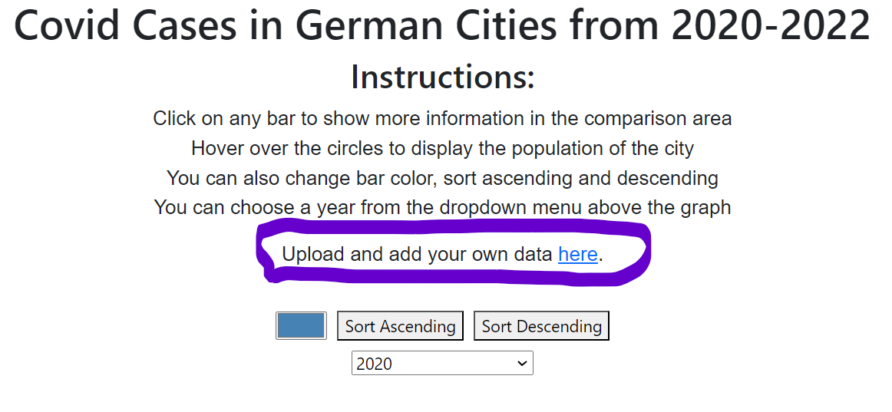

# COVID-19 Data Visualization in Germany (2020-2022)

## Description
This project aims to conduct a comprehensive analysis of the impact of the Covid-19 pandemic on Germany. Utilizing geographic and COVID-19 data sourced from the World Health Organization (WHO), the project attempts to offer an understanding of the virus' spread and its correlation with healthcare indicators. The primary objective is to analyze the relationship between total cases, population numbers, and death rates. By doing so, the project seeks to provide valuable insights into the effectiveness of healthcare systems across different regions in Germany in managing and mitigating the impact of future pandemics.

## Features

**Insights for each year**: Covid data visualization for covid cases throughout each year of the pandemic in the 40 most populated German cities.  

## Technologies Used

This project leverages several key technologies and frameworks to provide a robust and interactive data visualization experience:

- **Python**: The primary backend language, known for its readability and wide support in data processing and web development.
- **FastAPI**: A modern, high-performance web framework for Python, used for creating efficient API endpoints.
- **SQLite**: A lightweight database to store and manage the COVID-19 data in a structured format.
- **D3.js**: A powerful JavaScript library for producing dynamic, interactive data visualizations in web browsers.
- **HTML/CSS/JavaScript**: The core technologies of the web for structuring, styling, and adding interactivity to the web pages.
- **JSON**: Used for data storage and transfer, particularly for uploading new datasets and exchanging data between the backend and frontend.

## Key User Groups: Public Health researchers

## Objective:
The primary goal of this project is to empower public health researchers with a comprehensive tool for understanding and analyzing the spread and impact of COVID-19 in Germany. By providing access to regional and city-specific data, the tool aids in the development, adjustment, and assessment of effective public health policies and strategies. Additionally, by identifying trends and correlations, researchers can strategically plan and implement public health interventions.

## Functionality and Real-World Impact

The core functionality of this project lies in providing a dynamic and comparative analysis of COVID-19 data across various cities in Germany, which is pivotal for identifying patterns, determining hotspots, and recognizing anomalies in the virus's transmission. In a real-world context, this feature empowers researchers to leverage city-specific insights for investigating correlations between variables such as population density and virus spread. This kind of analysis is invaluable for future urban planning and healthcare resource management, helping to strategize more effectively against current and future public health challenges.
  

## User Benefit:
**Informed Decision Making**: The tool provides a user-friendly interface for accessing and interpreting complex data, leading to more informed and timely decision-making processes.  
**Strategic Planning**: Public health researchers can strategically plan and implement public health interventions by identifying trends and correlations.  

## Installation and Setup Instructions

### Running the Application in a Development Container Using GitHub Codespaces

1. **Open in GitHub Codespaces**:
   - Go to the GitHub repository: [https://github.com/ali-b7/Covid-Analysis-in-Germany.git].
   - Click on 'Code', then select 'Open with Codespaces'.
   - Choose 'New codespace' to create a new development environment.

2. **Automatic Setup**:
   - Once open in GitHub Codespaces, the development container will automatically set up the environment for you.  
   - However, if that does not work then run `uvicorn main:app --host 127.0.0.1 --port 8000 --reload` in the terminal. 

3. **Accessing the Application**:
   - Once the Codespace environment is ready and the application starts, go to the 'Ports' panel.
   - Find the port `8000` listed there.
   - Click on 'Open in Browser' next to port `8000`. This will open a new browser tab or window with the application running.

### Local Setup

1. **Clone the Repository**:
   - In the terminal, execute: `git clone https://github.com/ali-b7/Covid-Analysis-in-Germany.git`
   - Navigate to the cloned directory: `cd Covid-Analysis-in-Germany`

2. **Set Up a Virtual Environment (Optional but Recommended)**:
   - Create a virtual environment: `python -m venv env`
   - Activate the environment:
     - Windows: `env\Scripts\activate`
     - macOS/Linux: `source env/bin/activate`

3. **Install Dependencies**:
   - Ensure your virtual environment is activated.
   - Install required packages: `pip install -r requirements.txt`

4. **Starting the Application**:
   - Start the FastAPI server: `uvicorn main:app --host 127.0.0.1 --port 8000 --reload`
   - The application will be accessible at `http://localhost:8000`.
   - Uploading data works the same way as in running the applicaiton in a codespaces.

### Troubleshooting Common Setup Issues

- If you encounter any issues with package installation, try upgrading pip: `pip install --upgrade pip` and rerun the requirements installation.
- Ensure that the ports specified (e.g., 8000) are not in use. If they are, either free up the port or specify a different port in the `uvicorn` command.

## Testing with your own data
1. Above the graph you can find the option to upload your test json file.  
  

2. If you want to return to the original data then terminate the app in the terminal and restart it.

## Background Information
- The visualisation is built with D3.js.
- First, I wanted to put an actual map of germany as a heatmap into index.html; but it wasn't built with D3.js, so I dropped it. It was a clickable map of Germany, providing all the information from a federal state displayed by only one click on the desired region. It was supposed to give a first rough impression of the covid situation in Germany. This would have been an even easier way to access the desired information, since we want to serve the information to everyone.

## Contact
For support, feedback, or contributions, feel free to contact me:

- Email: ali.badran@stud.th-deg.de